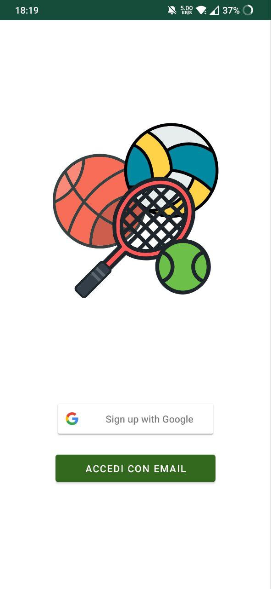
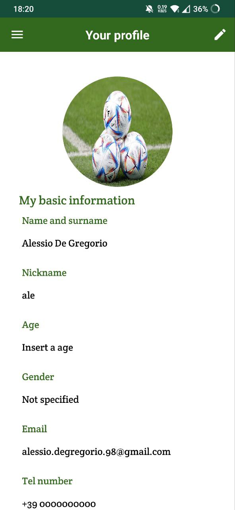
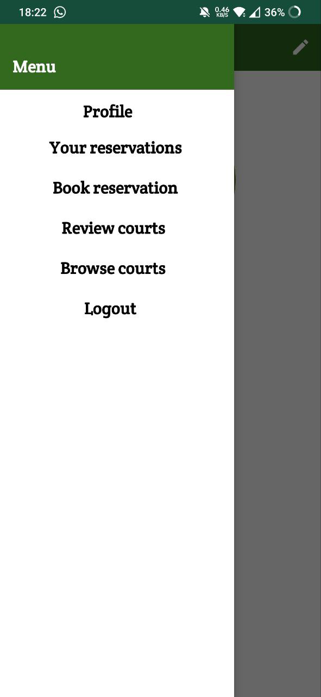
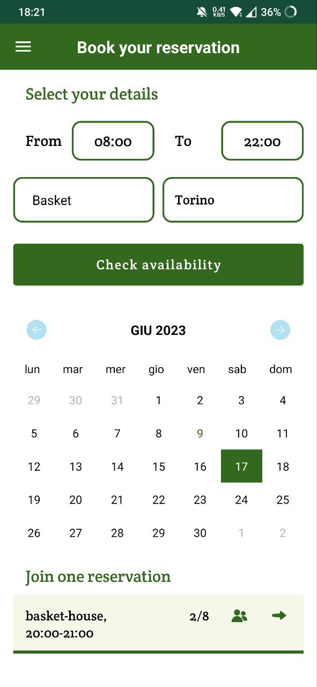
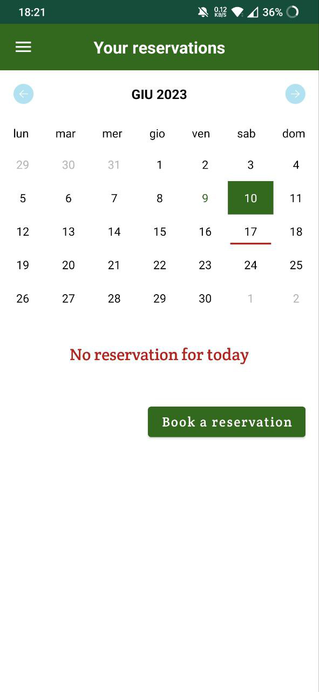
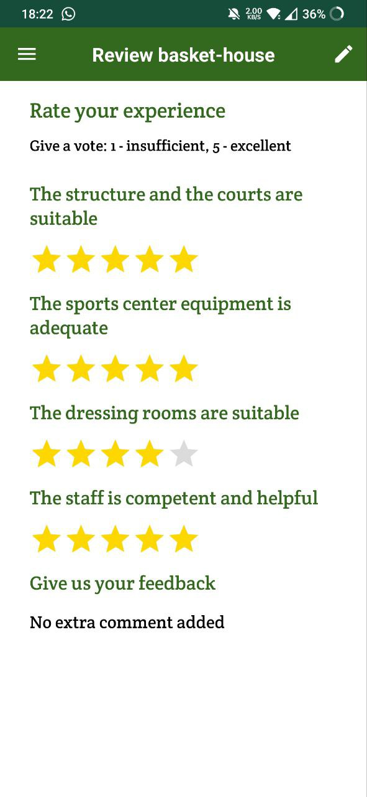

# Polito-AndroidProject
Group project for the realization of an Android app, to allow the booking of sporting courts. 
Backend has been realized using Firebase

# Project Specifications
Users signup using their Google account. Alternatively, it is possible to use a personal email and provide verification for it.
Users can:
- manage their own profile, choosing sports they are interested in, specifying their own mastery and achievements;
- looking for avalible fields according to some criteria, such as city, sport, date and time slot;
- check fields availability in real time;
- book a reservation;
- modify or delete an existing reservation;
- rate or review fields and structures according to their qualities;
- view the reviews left by other users to the various structures.

# Screenshot

