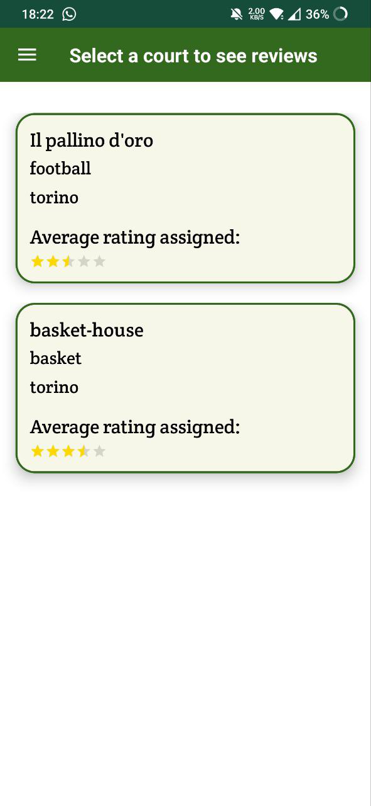

# Polito-AndroidProject
Progetto di gruppo per la realizzazione di un'app Android, per permettere la prenotazione di campi sportivi.
Il backend è stato gestito utilizzando Firebase

# Specifiche del progetto
Gli utenti effettuano l'iscrizione tramite account Google, oppure tramite verifica di un'email personale.
Gli utenti possono:
- gestire il proprio profilo, scegliere gli sport in cui sono interessanti, specificando il proprio livello e gli eventuali traguardi raggiunti;
- ricercare campi disponibili in base alla città, lo sport, la data e lo slot orario;
- visionare la disponibilità dei campi in tempo reale;
- effettuare una prenotazione;
- cancellare o modificare una prenotazione esistente;
- dare un voto o una recensione ai campi delle strutture in base alle loro qualità;
- visualizzare le recensioni lasciate da altri utenti alle varie strutture.

# Screenshot

